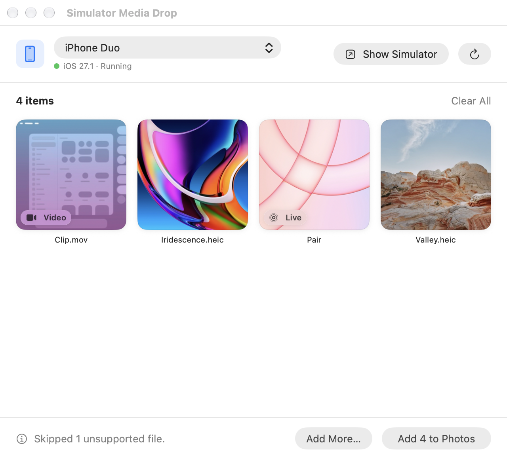

# Simulator Media Drop


A small macOS app that imports photos, videos and Live Photos into an iOS Simulator's Photos library.

Dragging media onto a simulator window stopped working reliably in Xcode 27's Device Hub. This app brings that workflow back without the terminal: pick a simulator, drop your files, click **Add to Photos**.



## Features

- Drop photos, videos or whole folders onto the window, or choose them with **File → Choose Files…** (⌘O).
- Live Photos: a still image and a video with the same name in the same folder are imported together as one Live Photo.
- Simulators are grouped by iOS version, and running ones are listed first.
- A simulator that isn't running starts automatically and opens in Simulator.
- Items that import successfully leave the queue. Items that fail stay there, show the error, and can be retried.

## Requirements

- macOS 14 or later
- Xcode with at least one iOS Simulator runtime installed
- **Xcode → Settings → Locations → Command Line Tools** set to the Xcode you want to use

## Installation

### Download

Download the latest `SimulatorMediaDrop.zip` from [Releases](../../releases), unzip it, and move the app to `/Applications`.

If a release isn't notarized, macOS blocks it on first launch. To open it anyway, go to **System Settings → Privacy & Security** and click **Open Anyway**, or run:

```bash
xattr -dr com.apple.quarantine "/Applications/SimulatorMediaDrop.app"
```

### Build from source

```bash
git clone https://github.com/<your-account>/SimulatorMediaDrop.git
cd SimulatorMediaDrop
open SimulatorMediaDrop.xcodeproj
```

Run the **SimulatorMediaDrop** scheme on **My Mac**. There are no third-party dependencies.

To build and test from the command line:

```bash
xcodebuild -project SimulatorMediaDrop.xcodeproj -scheme SimulatorMediaDrop -destination 'platform=macOS' test
```

## How it works

The app runs Apple's command line tools:

- `xcrun simctl list devices available --json` lists the simulators.
- `xcrun simctl bootstatus <udid> -b` boots a simulator that isn't running.
- `xcrun simctl addmedia <udid> <files…>` imports each queue item. The files of a Live Photo go in a single call, which is how `simctl` pairs them.

Because the app runs `xcrun`, it can't use the App Sandbox and isn't distributed through the Mac App Store.

## Troubleshooting

- **No simulators listed:** check that an iOS runtime is installed (**Xcode → Settings → Components**) and that Command Line Tools point to that Xcode. Then click Refresh (⌘R).
- **Imports go to Photos, not your app:** `addmedia` writes to the simulator's Photos library. Use your app's photo picker to reach the files.

## License

[MIT](LICENSE)
